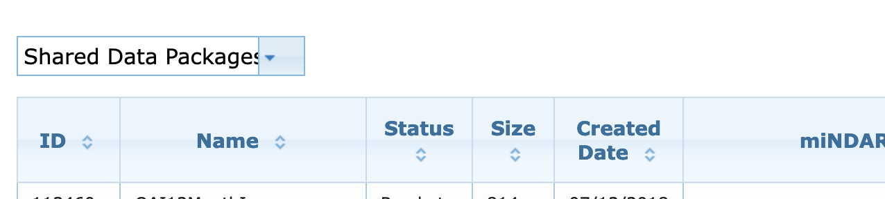
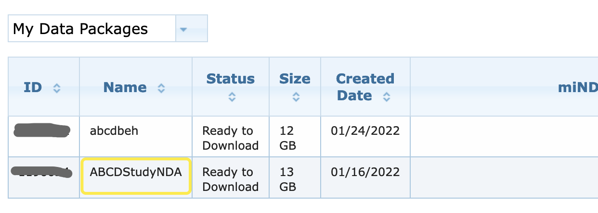
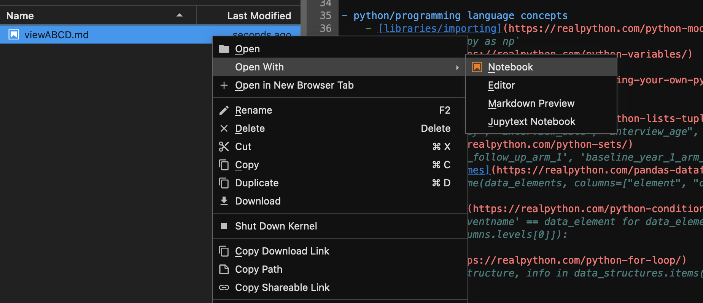

# Download, Inspect, and Visualize ABCD 4.0 Tabulated and Raw Behavioral Datasets

This is the first two installments in a series of data exercises for ABCD-ReproNim students on how to download, vizualize, and work with the ABCD data. They are intended as guided tutorials that will prepare for Project Month (to be held on April 4th - April 29th, 2022). By working through these exercises you will have the opportunity to explore the ABCD data, generate ideas about what kind of project you might like to work on during Project Month, and get practice with various technical/programming skills that will be useful in carrying out your project idea. You are welcome and encouraged to download data to the [ABCD-ReproNim JupyterHub](https://abcd.repronim.org/). If you need access to the Hub you can request it [here](https://docs.google.com/forms/d/e/1FAIpQLSefrxRzdjFak_BoxTL5bE-TnsJdg9KbGvFdOwuW7zliZ96z7g/viewform?usp=sf_link).

This data exercise is intended for students who have _already obtained_ [ABCD data access](https://docs.google.com/document/d/18hsT2x15bypuXFcfMQb9Ck_YEB7VvY2j4w5hwbV78A4/edit#heading=h.ifsu9kkjrdcu). However, broad concepts (e.g., working with and visualizing data in Python) are generalizable across other data sets, but many of the steps and instructions in this exercise are specific to the ABCD study. If you do not have/are not able to receive ABCD data access then we still encourage you to engage with this assignment! Publicly available, non-ABCD data alternatives such as those in the [Human Connectome Project](http://www.humanconnectomeproject.org/), [OpenNeuro](https://openneuro.org/), or any other dataset that you may have access to can be adapted (but perhaps not directly mapped onto) to the steps outlined in this data exercise. If you are unable to use the ABCD data then our hope is that you can still learn from the general principles we cover by adapting them to a different dataset you do have access to.

This assignment has a suggested due date of March 21st, which is the start of Project Month. Unlike the Data Exercises you’ve been turning in thus far in the course, this data exercise does not have any multiple choice questions to answer. We will not be asking you to submit anything for this Project Month Prep Data Exercise. However, ABCD-ReproNim TAs will be available to give you feedback on the code you generate from this tutorial upon request.

## Task 1: Download the ABCD 4.0

Learning Objectives:
- Use NDA to access a Data Package;
- Use NDA tools to generate cool authorization to access ABCD data;
- Use NDA tools to fetch the Data Package to your system

Mapping to Course Materials: [NDA Presentation](https://www.youtube.com/watch?v=QfhbPF4d1pM&t=3508s), [Git and Shell Basics](https://abcd-repronim.github.io/materials/week-2/)

Note: The `$` symbol indicates text that should be typed into the command line in Terminal; you don't need to type it.

The [ABCD Curated Annual Release 4.0](https://nda.nih.gov/general-query.html?q=query=featured-datasets:Adolescent%20Brain%20Cognitive%20Development%20Study%20(ABCD)) contains all data from the entire Curated Annual Release 4.0, (except for the associated images) and is about 14GB in size. This data does include the S4 paths to the imaging data, so never fear, from this data we can get to the imaging data.

### 1.1 Get a ‘Package ID’ for your copy of the Annual Release 4.0

Go to the [ABCD page](https://nda.nih.gov/general-query.html?q=query=featured-datasets:Adolescent%20Brain%20Cognitive%20Development%20Study%20(ABCD)) on the [NDA website](https://nda.nih.gov). Under the [**OPTION ONE** subsection](https://nda.nih.gov/general-query.html?q=query=featured-datasets:Adolescent%20Brain%20Cognitive%20Development%20Study%20(ABCD)#:~:text=datasets%20of%20interest.-,OPTION%20ONE,-Option%201%20provides), click **Access Shared Data Pakages**. After signing in with your NDA credentials you will be directed to [this page](https://nda.nih.gov/user/dashboard/packages.html?dataset=Adolescent+Brain+Cognitive+Development+Study+%28ABCD%29&type=shared_packages).
Here, you will see a set of **Shared Data Packages**. One of these is called **ABCDStudyNDA**. In the **Actions** for this row, select **Add to My Data Packages**. You should get a green notice on the page to confirm success. Note: if you couldn't find **ABCDStudyNDA** in the **Shared Data Packages** list then it may alreay exist in **My Data Packages**.



Now, change your view to **My Data Package**.



You should be able to see your data pacakage and its ID.
Proceed to the next step armed with this **Package ID Number**.

### 1.2 Download ABCD 4.0
Now that you have the Package ID from the step above, you can use the following command (from the [NDA tools](https://github.com/NDAR/nda-tools) library that we have installed for you on the [ABCD-ReproNim JupyterHub](https://abcd.repronim.org/)) to download this package:

`$ downloadcmd -dp <package_id> -d ABCD4`

Input your nda username and password when it asks.

If you get the following warning:
```
Running NDATools Version 0.2.13
Your version of nda-tools is out of date. Please upgrade to the latest version (0.2.14) from PyPi or GitHub and try again.
        To upgrade using pip, run:
pip install nda-tools==0.2.14
```
Run `$ pip install nda-tools==0.2.14`, then `$ downloadcmd -dp <package_id> -d ABCD4`

The above download may take ~10 minutes on the [JupyterHub](https://abcd.repronim.org/). Once this is completed, you have the Release 4.0 content! Go forth to Task 2...

## Task 2: Inspect the data

### 2.1 Do you have the correct data?

If all has gone well, you would have a folder (ABCD4) containing the downloaded files. In this section of the assignment we are going to help you walk through how to read in the files you have just downloaded. We’ll also show you some techniques in how to visualize the data that you have just downloaded.

First, let's use the Terminal on [JupyterHub](https://abcd.repronim.org/) to verify a few things about the download.

If you do not see the above Terminal icon, click on the __File__ menu in [JupyterHub](https://abcd.repronim.org/) and then click __New Launcher__.

Note: The `$` symbol indicates text that should be typed into the command line in Terminal; you don't need to type it.

We can check the total size of this directory (you might get a slightly different number):

`$ du -s ~/ABCD4`

Return:

`14374016        /home/jovyan/ABCD4`

You can also view the size in more compact format using the `-sh`:

`$ du -sh ~/ABCD4`

Return:

`14G     /home/jovyan/ABCD4`

If the above does not match, you may want to revisit the downloading steps.

### 2.2 What do the names of each file mean and what data do they contain?

If you look in the directory you will find that most of the files are txt files:

`$ ls ~/ABCD4/*.txt | wc -l`

Return:

`374`

You can also find the files or folders/directories that are not txt files:

`$ ls ~/ABCD4 | grep ".*[^txt)]$"`

Return:
```
abcd-4.0-data-dictionaries.zip
experiments
README.pdf
study_1299.pdf
```

Note: If you would like to dig deeper into what these characters mean in the last section of the above command [here's an application](https://regex101.com/r/E3ZakR/1/) walking through the meaning of this regular expression.

As you can see there are two PDF files. Using the file browser on the left you can select and open the PDF files. These provide some information about the study, but not about every single txt file you have downloaded.

Let us look at one of the first two lines of one of the txt files. You will notice that these text files are like spreadsheets. Each file contains multiple columns. The first row describes a short variable name for each column, while the second row contains some description of that variable name. The remaining rows contain the data from a participant.

Type:

`$ head -n 2 ~/ABCD4/abcd_ant01.txt`

Return:

```
"collection_id" "abcd_ant01_id" "dataset_id"    "subjectkey"    "src_subject_id"        "interview_date"        "interview_age" "sex"   "eventname"     "anthro_1_height_in" "anthro2heightin"       "anthro3heightin"       "anthroheightcalc"      "anthroweightcast"      "anthro_weight_a_location"      "anthroweight1lb"       "anthroweight2lb"    "anthroweight3lb"       "anthroweightcalc"      "anthro_waist_cm"       "anthro_timestamp"      "anthro_weight3_hybrid_lb"      "anthro_weight1_hybrid_lb"   "anthro_waist_hybrid_cm"        "anthro_weight2_hybrid_lb"      "collection_title"      "study_cohort_name"
"collection_id" "abcd_ant01_id" "dataset_id"    "The NDAR Global Unique Identifier (GUID) for research subject" "Subject ID how it's defined in lab/project"    "Date on which the interview/genetic test/sampling/imaging/biospecimen was completed. MM/DD/YYYY"    "Age in months at the time of the interview/test/sampling/imaging." "Sex of subject at birth"        "The event name for which the data was collected"       "STANDING HEIGHT #1 (in inches)"        "STANDING HEIGHT #2 (in inches)"    "STANDING HEIGHT #3 (in inches)" "Standing Height Average (inches): If three measurements were obtained, the two closest measurements will be averaged. Should the third measurement fall equally between the first two measurements, all three will be averaged."    "Participant Wearing a Cast or Medical Prosthesis?"     "Location of Cast or Medical Prosthesis"     "Make sure shoes and unnecessary layers of clothes (jackets or hats) have been removed before taking weight measurement.) 1. Okay, make sure you empty your pockets for this next measurement. Please stand completely still in the center of the scale with your feet close together, your hands at your side, and your head looking straight ahead. Please stay as still as possible while I measure your weight. (OBTAIN & RECORD WEIGHT #1 (in lbs))" "2.  Ok, you can relax and step away from the scale. 3. Now step back on the scale again for another measurement and remember to stand completely still in the center of the scale with your feet close together, your hands at your side, and your head looking straight ahead. Please stay as still as possible while I measure your weight. (OBTAIN & RECORD WEIGHT #2 (in lbs))"   "If measurements differ by > 0.1 pounds, the program will prompt you to take a third measurement. 4.  Ok, you can relax and step away from the scale. 5.  Please step back on the scale again for another measurement and remember to stand completely still in the center of the scale with your feet close together, your hands at your side, and your head looking straight ahead. Please stay as still as possible while I measure your weight. (OBTAIN & RECORD WEIGHT #3 (in lbs))"      "Average Measured Weight (lbs):If three measurements were obtained, the two closest measurements will be averaged. Should the third measurement fall equally between the first two measurements, all three will be averaged."        "Measured circumference (in inches):"   "Current Time:" "If measurements differ by > 0.1 pounds, the program will prompt you to take a third measurement"    "Make sure shoes and unnecessary layers of clothes (jackets or hats) have been removed before taking weight measurement.)"   "Please adjust or unfold your pants to remove any additional thickness or bunching. 1. Now I'd like you to take your thumb and find the pointy bone on the front of your left side body where a belt might go. Once you find it, trace that bone all the way up to its highest point. (Demonstrate the desired position of the arms. RA can do this to their own body as they're talking, so the participant has more guidance.) 2. Once you find the top part of the bone, keep your left fingers there while, with your right hand, you place the tape measure across your stomach then wrap it around yourself so it's in line with those points.? 3. Ok, I am going to make sure it is in the right location and write down the number. (Take the measurement to the nearest 0.1 inch.)"        "2. Ok, you can relax and step away from the scale. 3. Now step back on the scale again for another measurement and remember to stand completely still in the center of the scale with your feet close together, and your head looking straight ahead. You are going to keep one hand at your side and with your other hand your are going to move the blocks. Stay as still as possible while you measure your weight.  Please move the big bottom block first to 50 then move the upper smaller block at the top until you are able to balance the arrow on the right. (Ask youth to adjust the blocks as necessary. OBTAIN & RECORD WEIGHT #2 (in lbs))" "collection_title"      "study_cohort_name"
```

We can use NDA's services to find more details about each file. In the NDA, each filename corresponds to a data structure (e.g., abcd_ant01) and each column name (e.g. subjectkey) is a data element. The same data elements (e.g, subjectkey, sex) may appear in multiple files and refers to the same kind of information.

For any of the data structures, you can view the details using a direct url such as this

https://nda.nih.gov/data_structure.html?short_name=abcd_ant01

or by searching using the NDA query tool

https://nda.nih.gov/general-query.html?q=query=data-structure%20~and~%20searchTerm=abcd_ant01

For data elements, you can use another NDA query tool:

https://nda.nih.gov/general-query.html?q=query=data-element%20~and~%20searchTerm=name:%20%22subjectkey%22

The NDAR guid is the identifier attached to each participant. This is the key to finding information for participants across different data structures.

We can retrieve a column of GUIDs in the file. Note we start our counting from the third line and use awk to print the 4th column (the subjectkey).

`$ tail -n +3 ~/ABCD4/abcd_ant01.txt | awk '{print $4}' | wc -l`

Return:

`39766`

Note: if you need a refresher on the unix commands being used in the above or any of the following commands you can find helpful information in the manual pages (in Terminal, type man `<unix command>` or you can access the manual information for each command online [here](https://man7.org/linux/man-pages/dir_section_1.html).)


We can now get the unique number of GUIDs in the dataset:


`$ tail -n +3 ~/ABCD4/abcd_ant01.txt | awk '{print $4}' | sort | uniq | wc -l`

Return:

`11876`

### 2.3 Can you retrieve some data?

Using the data you have downloaded, you can make a list of all the data elements available in the ABCD study by using the following set of commands:

```
$ for f in $(ls ABCD4/*.txt); do awk -F'\t' 'NR<=2 {data[NR]=$0} END {split(data[1], cols, "\t"); split(data[2], desc, "\t"); for(i=1; i<=NF; i++) {print cols[i] "\t" desc[i]}}' $f >> output; done && cat output | awk -F'\t' '{print $1 $2}' | sort | uniq >> elements_list.txt && rm output
```

This (albeit very complicated) series of shell commands creates a file called `elements_list.txt` that contains a list of all the data elements in the ABCD study along with their descriptions, each in the format data_element `<TAB>` description. Don’t worry if you don’t understand all of the components that go into this shell command (but it should perhaps show you how powerful the awk command can be!) Go ahead and copy, past, and then run the above command on your Terminal. It will take a few moments to finish running as it has to read in each data_element and description from all 14GB of the ABCD study data. Once it has finished you can view the contents of the file by either printing it out to your screen or opening it with Nano.

Note: The Jupyter Notebook we will fetch from GitHub in just a moment will perform the same action as above but with using Python. Working with the data in both ways (e.g., with shell and in Python) will hopefully give you an idea of two different methods to read in/characterize the data that was just downloaded.

Now that you have a list of data elements in elements_list.txt, can you find 5 data elements for each of the following 4 categories:

- demographic
- clinical
- behavioral
- imaging

Hint: you might find it helpful to search `elements_list.txt` for specific strings of interest by using the grep command. You can use grep to search for multiple strings at once via:

`$ grep ‘string 1’ elements_list.txt | grep ‘string 2’ | grep ‘string 3’`

Make sure to have some categorical and continuous variables, and make sure that two of the demographic variables are `sex` and `site`. Additionally, for the purposes of TAs being able to help you troubleshoot your work if you run into any problems, we also suggest you choose `anthroheightcalc` and `anthroweightcalc` as demographic variables (although you can of course examine whichever, and as many, elements as you want.) Some factors you may want to keep in mind when selecting the variables you will carry into the next portion of this assignment:

- How many NaNs are there?
- If categorical, what are the categories and is there enough representation of each category?
- Are you interested in a collection of questionnaire items that can be combined to make a score?

For the next part of this assignment we will be working in Python with the 20 variables you have chosen. Feel free to work in `R` or any other language that you prefer but keep in mind that our example code is written in `Python` (which has become an increasingly adopted language used to perform analyses in neuroimaging studies).

To start we recommend that you create your own Jupyter Notebook on the JupyterHub. This will be where you will work with the 20 variables you have created. To create a new Jupyter Notebook navigate to the **File** menu in Jupyterhub, click New Launcher, and then click on the Python 3 icon under Notebook.

Next, let’s fetch a pre-written [viewABCD](https://github.com/ABCD-ReproNim/exercises/blob/main/project_month_prep/viewABCD.md) Notebook we created that has example code for you to use in the next part of the assignment. This Notebook is meant as a fully executable guide that you can copy and paste code blocks from as you complete the questions we ask you below.

`$ wget https://raw.githubusercontent.com/ABCD-ReproNim/exercises/main/project_month_prep/viewABCD.md`

If everything worked successfully you should have a new file in your home folder on the JuputerHub called viewABCD.md. This file should look a lot like the [viewABCD.md file](https://github.com/ABCD-ReproNim/exercises/blob/main/project_month_prep/viewABCD.md) on our GitHub repository - the difference being that your local file has executable code blocks. This notebook walks you through reading, filtering, and visualizing the ABCD data you just downloaded. It also will provide you with code that you can copy and past into your own Jupyter Notebook where you can explore the 20 variables you have just chosen.

You can open viewABCD.md on the JupyterHub as a Notebook by right clicking the file then choosing Open With and Notebook:



As in any Jupyter Notebook, each code block is run by clicking on the cell that contains the code and then pressing SHIFT + ENTER on your keyboard to execute the commands.

For each data structure in the ABCD data, you will find that there are multiple rows that belong to an individual with the same NDAR GUID. On your own Jupyter Notebook, and using viewABCD.md as a guide,  read, filter, and then extract the data for your 20 variables for the first session (e.g., baseline measure) of N participants. As done in viewABCD.md, we suggest that you read in the relevant data from data structures into dataframes and then merge the different dataframes to construct a single dataframe that has N participants by 20 columns.

You can sample 1000 random participants to start with. Save this dataframe as a csv file. We will use this file in 2d.

(Optional) Create a JSON file describing each of the columns to convey the appropriate semantics and provenance of the columns.

### 2.4 Can you visualize the data?

We are going to create a few visualizations of the data. You will need to manipulate your dataframe to represent the data in a way that makes it easier to plot. These representations may be slightly different for if you chose to use R or a non-Python programming language.

1. A regression plot ([Faceted logistic regression — seaborn 0.11.0 documentation](https://seaborn.pydata.org/examples/logistic_regression.html))

    Choose a brain imaging variable and a clinical variable that are both continuous. Now plot a relation between these two variables grouped by sex of the participants.

2. A pair plot ([Scatterplot Matrix — seaborn 0.11.0 documentation](https://seaborn.pydata.org/examples/scatterplot_matrix.html))

    In such a plot the values of each variable is plotted against the other variable with specific distributions color coded by some group. Choose sex as your group variable and one variable from each of the four categories.

3. Can you plot all 20 variables simultaneously? ([pandas.plotting.parallel_coordinates — pandas 1.1.4 documentation](https://pandas.pydata.org/pandas-docs/stable/reference/api/pandas.plotting.parallel_coordinates.html)) For an interactive plot you can use plotly ([Parallel Coordinates Plot | Python](https://plotly.com/python/parallel-coordinates-plot/)) in the notebook.

4. Plotting distributions: A violin plot grouped by sex. ([Grouped violinplots with split violins — seaborn 0.11.0 documentation](https://seaborn.pydata.org/examples/grouped_violinplots.html))

    For this exercise you will need two categorical variables and one continuous variable. You are going to show how the continuous variable behaves as a function of the categorical variables. (Optional) Can you think of some ways of estimating if a variable is continuous or categorical?

In the [next Project Month Prep Data Exercise](https://github.com/ABCD-ReproNim/exercises/blob/main/project_month_prep/downloadMRI.md) we will give a tutorial on how to download the ABCD 4.0 imaging data.
