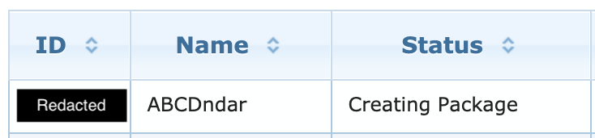

# Downloading the ABCD imaging data

In the previous data exercises you have downloaded and interacted with the [ABCD 3.0 release](https://nda.nih.gov/abcd/query/abcd-curated-annual-release-3.0.html). #link is broken--maybe use https://nda.nih.gov/study.html?id=901
While there are many measures derived from the imaging data within the pre-packaged tabulated data, you may have noticed that the full set of MRI images are not included in this release.

As stated on [NDA's website](https://nda.nih.gov/abcd/query/abcd-curated-annual-release-3.0.html): 

"The raw MRI images and the minimally processed imaging files are over 100TB in size which may make data transfer difficult. "

The data are stored on [Amazon Simple Storage Service (s3)](https://docs.aws.amazon.com/AmazonS3/latest/userguide/Welcome.html) servers. 

There are multiple routes to obtaining the full imaging data, we'll focus on the following two:
1. Using links from the [fmriresults01](https://nda.nih.gov/data_structure.html?short_name=fmriresults01) structure
2. Using the [nda-abcd-s3-downloader](https://github.com/DCAN-Labs/nda-abcd-s3-downloader)

Both routes involve creating a data package through the NDA, downloading a manifest file, parsing the manifest file, and finally downloading the data.

For brevity, the exercises in this notebook will guide you through downloading the resting state and T1w data from 5 subjects using each of the above download methods. You will need active NDA credentials and an ABCD DUC to download the data.

**A Note about GUIDs and BIDS**

[From the NDA](https://nda.nih.gov/s/guid/nda-guid.html): "The Global Unique Identifier (GUID) is a subject ID allowing researchers to share data specific to a study participant without exposing personally identifiable information (PII) and match participants across labs and research data repositories."

The GUID's format is `NDAR_INVXXXXXXXX`, where `XXXXXXXX` is a random string of numbers and uppercase letters. The standard GUID format is *not* [BIDS compatible](https://bids-specification.readthedocs.io/en/stable/02-common-principles.html#file-name-structure). In BIDS, the underscore character is reserved to separate key:value entities (eg, `key1-value1_key2-value2`, `sub-01_task-rest`). For the BIDS imaging data on the NDA, the underscore in the GUID has been removed (ie, `NDARINVXXXXXXXX`), but be aware that you might need to do a string replace operation to remove the underscore from the GUIDs in the tabulated data to match the GUIDs in the BIDS imaging data.


***

## Downloading the data using the fmriresults01 structure

The general workflow on the NDA is to add data to your Filter Cart and then create a Data Package from the filter. Here we will create a Data Package from the *fmriresults01* data structure. See Getting Image Volumes [here](https://nda.nih.gov/abcd/query/abcd-release-faqs.html) for more info on the *fmriresults01* structure.

**NOTE**: The `fmriresults01.txt` file is distributed in the ABCD 3.0 Release. So if you've already downnloaded that, then you could use that file. If so, you can skip to step 13.

1. Let's begin at the [NDA's front page](https://nda.nih.gov/). Select **Get Data** > **Get Data**


***

2. On the **NDA Query Tool**'s menu, select **Data Structures**. Then enter "fmriresults01" into the Text Search field and hit enter.


***

3. Click the **Processed MRI Data** link, which will open the structure. Then select **Add to Filter Cart** in the lower left corner.


Your Filter Cart will take a few minutes to update. Make yourself some tea. Once it is finished, you should see the following.


(Sample size may vary depending on when you are working through this exercise)

***

4. In the Filter Cart, select **Create Data Package/Add Data to Study**, which will take you to the Data Packaging Page.

5. On the Data Packaging Page, select **Create Data Package**.


6. If you are not logged into the NDA, this will prompt you to log in with your credientials. After, you will see a menu to define your Data Package. Give it a short name and ensure that **Include Associated Data Files** is *unchecked*. Otherwise, the Data Package will contain the all images in *fmriresults*. It will be faster and more flexible to only download the pointers to the data and not the data istself. When you are finished entering this information, click **Create Data Package**.


***

7. You will see a window that confirms that your package was initiated. Click the link to navigate to your Dashboard.


***

8. In the drop down menu on the Data Package Dashboard, select **My Data Packages**. You should see the Data Package you just created. It will take a few minutes to move from the "Creating Package" status to "Ready to Download". Maybe refill your tea. In the below image **ABCDndar** is the Data Package we just created. **ABCDdcan** will be created in the second section of this exercise.




***

9. Once the Data Package is ready to download, we can use the [NDA tools](https://github.com/NDAR/nda-tools) to download it. The NDA tools are already installed and ready to use on the ABCD-ReproNim JupyterHub. The relvant command will be `downloadcmd`. Let's see what options `downloadcmd` has.

```python
! downloadcmd -h
```

Recall that the `!` in the code cell of a Jupyter notebook means to execute that command using shell.


***

10. Our first usage of `downloadcmd` will use the Package ID to download the associated package files. Let's put the ABCDndar package into it's own directory. If you have already set up your NDA credentials to download the ABCD 3.0 Release, then `downloadcmd` will use the already stored credentials.  

```python
! mkdir /home/jovyan/ABCDndar
! downloadcmd <package_ID> -dp -d /home/jovyan/ABCDndar # replace <package_ID> with your ID
```

***

11. Once the download is complete, we can list the files. The relevant file is `fmriresults01.txt`, which contains information about each image in this structure.

```python
! ls /home/jovyan/ABCDndar
```

***

12. `fmriresults01.txt` is a tab-separated table that contains information about corresponding image files. Let's read this table into python so that we can parse and choose only the image files we want.

```python
import pandas as pd
fmri = pd.read_csv('/home/jovyan/ABCDndar/fmriresults01.txt', sep='\t', low_memory=False)
```

*** 

13. Let's look at the structure and contents of the `fmriresults01.txt`. 

```python
fmri.head()
```

We can see that the first row contains a detailed description of the column. We won't need to include this in our parsing, so we can drop it.

```python
fmri = fmri.drop([0])
```

***

14. We do not need most of the information in this table. The relevant columns are `file_source`, which contains the s3 links to the raw DICOM images and `derived_files` which contains the s3 links to the minimally preprocessed images. Here we will focus on downloading the minimally processed files in `derived_files`. We will create a dataframe that contains the s3 links and other relevant fields so that we can filter the s3 links. Explore other columns of this table to see the processing steps that has been applied to the `derived_files`.

```python
s3_derv = fmri.loc[:,['derived_files']] # create a new data frame from the derived_files column
```

Let's look at the format of the s3 links to see how we could parse this for filtering:

*s3://NDAR_Central_4/submission_32739/NDARINVXXXXXXXX_baselineYear1Arm1_ABCD-MPROC-SST-fMRI_XXXXXXXXXXXXXX.tgz*

- *s3://NDAR_Central_4/submission_32739* is the location of the data on the s3 server
- *NDARINVXXXXXXXX* is the GUID
- *baselineYear1Arm1* is the session
- *ABCD-MPROC-SST-fMRI* is the scan type information
- The number at the end of the file is the acqusition date/time
- *.tgz* is the TAR archive file extension

We can use python's ability to split strings to parse these strings so that we can filter by GUID, session, and scan type. Let's see an example:

```python
example = 's3://NDAR_Central_4/submission_32739/NDARINVXXXXXXXX_baselineYear1Arm1_ABCD-MPROC-SST-fMRI_XXXXXXXXXXXXXX.tgz'
example.split('/')
```

The above code splits the `example` string into a list of strings at every occurence of `/`.

`.split` only operates on strings, but we have an entire column of strings we want to split. Here we can leverage python's list comprehension to iterate through each string.

For example:

```python
test_split = [i.split('/') for i in s3_derv['derived_files']]
test_split[0:3]
```

The above code submits the same split operation to every item in the `s3_derv['derived_files']` data frame we created above. You could also complete this with a regular `for` loop, but list comprehension is cleaner and more efficient.

We can leverage string splitting and list comprehension to parse each s3 link into a corresponding GUID, session, and scan type.

```python
s3_derv['guid'] = [i.split('/')[-1].split('_')[0] for i in s3_derv['derived_files']] # get the GUID
s3_derv['session'] = [i.split('/')[-1].split('_')[1] for i in s3_derv['derived_files']] # get the session
s3_derv['scan'] = [i.split('/')[-1].split('_')[2].split('-',1)[-1] for i in s3_derv['derived_files']] # get the scan type

s3_derv.head()
```

The above list comprehension and string splitting code looks complicated, let's break downb the code for parsing the scan type:

- `[i for i in s3_derv['derived_files']` is looping through every string in `s3_derv['derived_files']`. `i` will be the string in the current iteration.
- `i.split('/')[-1]` gives us the last (`[-1]`) item in the list (the filename) once you split the full s3 link by the `/` character.
- The second `.split('_')[2]` splits the filename by `_`. `[2]` is choosing the third item in that list (because of 0 indexing). This is `ABCD-MPROC-SST-fMRI` in the above example.
- The third `.split('-',1)[-1]` is splitting `ABCD-MPROC-SST-fMRI` by `-`, only by the first occurence of `-`. `[-1]` means that we are grabbing the last in that two item list (`MPROC-SST-fMRI`).


Now we have a dataframe where we can filter s3 links by GUID, session, and scan type! Let's see what scan types we have:

```python
s3_derv['scan'].value_counts()
```

***

15. Let's specify our filtering critera. Choose 5 subject GUIDs (you can choose 5 random GUIDs from your work on the ABCD 3.0 Release), only the `baselineYear1Arm1` session, and scan types of `MPROC-T1` and `MPROC-rsfMRI`.

```python
subjs = [ ] # enter 5 GUIDs.
runs = ['MPROC-T1', 'MPROC-rsfMRI'] # need to match the scan types in s3_derv
ses = ['baselineYear1Arm1'] # session

# filter the s3_derv data frame using the above filters
sub_s3derv = s3_derv[s3_derv['guid'].isin(subjs) & s3_derv['scan'].isin(runs) & s3_derv['session'].isin(ses)]
sub_s3derv.sort_values(['guid', 'scan']) # sort to make it pretty
```

Let's see a count of how many s3 links met the filter criteria.

```python
sub_s3derv['scan'].value_counts()
```

***

16. Great! Now we can write the filtered s3 links to a text file. `s3_derv_links_5subj.txt` will be a simple text file that only contains the relevant s3 links.

```python
with open('/home/jovyan/ABCDndar/s3_derv_links_5subj.txt', 'w') as f:
    f.write('\n'.join(sub_s3derv['derived_files']))
```

***

17. Now we can use `downloadcmd` to download the actual data! Let's also make a directory to store the downloaded files. The download will take a few minutes. Brew some more tea.

```python
! mkdir /home/jovyan/ABCDndar/tar_files
! downloadcmd -d /home/jovyan/ABCDndar/tar_files -t /home/jovyan/ABCDndar/s3_derv_links_5subj.txt
```

***

18. Let's list out the files we've downloaded. You'll notice that the data was downloaded into a `submission_XXXXX` directory. You will also notice that the files are in `.tgz` format. The last step will be to unzip the files. The unzipping and `datalad save` steps will take a few minutes. Fourth tea refill is a charm!

The `%%bash` in the cell tells the entire cell to run the code in bash.

```python
! ls /home/jovyan/ABCDndar/tar_files
```

```bash

# let's use datalad to track the unzipped dataset
datalad create /home/jovyan/ABCDndar/image_files

# now unzip the files
cd /home/jovyan/ABCDndar/tar_files
for sub in submission_*; do
    cd $sub
    for f in *.tgz; do
        tar zxf $f --directory /home/jovyan/ABCDndar/image_files
    done
done
```

```bash

# track the changes in datalad
cd /home/jovyan/ABCDndar/image_files
datalad save -m 'add unzipped files from NDA' .
```

Let's look at the log to see the changes we've made to this dataset.

```bash

cd /home/jovyan/ABCDndar/image_files
git log
```

### Success!!
# 🎉🎉🎉


***

## Downloading the data using the nda-abcd-s3-downloader

The [Developmental Cognition and Neuroimaging Lab (DCAN)](https://www.ohsu.edu/school-of-medicine/developmental-cognition-and-neuroimaging-lab) at Oregon Health & Science University has created a handy tool to make downloading easier. In addition, they have uploaded preprocessed derivatives to facilitate quick analysis. More information about the specific contents and preprocessing pipeline can be found at the [Collection 3165 documentation page](https://collection3165.readthedocs.io/en/stable/release_notes/). The procedure for preparing the final download is similar to the procedure above.

First you need to create a package and download the list of files contained in Collection 3165. Below are the instructions for using this tool from the [`nda-abcd-s3-downloader` README](https://github.com/DCAN-Labs/nda-abcd-s3-downloader). 

1. Navigate to the [NDA website](https://nda.nih.gov/general-query.html?q=query=collections%20~and~%20searchTerm=DCAN%20Labs%20ABCD-BIDS%20MRI%20pipeline%20inputs%20and%20derivatives%20~and~%20orderBy=id%20~and~%20orderDirection=Ascending) 
2. Under "Get Data" select "Data from Labs"
3. Search for "DCAN Labs ABCD-BIDS MRI pipeline inputs and derivatives"
4. After clicking on the Collection Title select "Shared Data"
5. Click "Add to Cart" at the bottom
6. It will take a minute to update the "Filter Cart" in the upper right corner, but when that is done select "Package/Add to Study"Select "Create Package", name your package accordingly, and click "Create Package"
- IMPORTANT: Make sure "Include associated data files" is deselected or it will automatically attempt to download all the data through the NDA's package manager which is unreliable on such a large dataset. That is why we've created this downloader for you.
7. Now download the "Download Manager" to actually download the package or use the NDA's nda-tools to download the package from the command line. This may take several minutes.
8. After the download is complete find the "datastructure_manifest.txt" in the downloaded directory. This is the input S3 file that contains AWS S3 links to every input and derivative for all of the selected subjects and you will need to give the path to this file when calling download.py


***
 Hopefully most of the steps to download the manifest sound familiar. Once you have created the Data Package in the NDA, you can proceed.
 
 9. Let's make a directory and download the data package.

```python
! mkdir /home/jovyan/ABCDdcan
! downloadcmd <package_ID> -dp -d /home/jovyan/ABCDdcan # replace <package_ID> with your ID
```

```python
! ls /home/jovyan/ABCDdcan
```

***

10. We should see `datastructure_manifest.txt` in `/home/jovyan/ABCDdcan`. This is the file that contains all of the s3 links for the input and derivative data. As before, we'll need to filter the larger file, but we'll do so in a different way. But first, we need to clone the [nda-abcd-s3-downloader](https://github.com/DCAN-Labs/nda-abcd-s3-downloader).

```bash

cd /home/jovyan/ABCDdcan
git clone https://github.com/DCAN-Labs/nda-abcd-s3-downloader.git
```

***

11. The `nda-abcd-s3-downloader` accepts a `data_subsets.txt` file in which we can specify which subsets of the data we want. Let's download some raw (input) data and some derivative data, but keep them separate. You can see the list of data subsets [here](https://github.com/DCAN-Labs/nda-abcd-s3-downloader/blob/master/data_subsets.txt). First, we'll download the inputs.

```bash

cd /home/jovyan/ABCDdcan
# write inputs of interest to inputs.txt
echo inputs.anat.T1w >> inputs.txt
echo inputs.func.task-rest >> inputs.txt
```

***

12. Now that you have the data subsets, you'll also need to create a subject subset file. You can use the same subjects as you did for the above exercise. Create a file called `5subjects.txt` that contains the following format. You can `echo` the GUIDs to a text file as we did with the inputs above, or you can create a text file outside of this notebook.

```
sub-NDARINVXXXXXXXX
sub-NDARINVXXXXXXXX
sub-NDARINVXXXXXXXX
sub-NDARINVXXXXXXXX
sub-NDARINVXXXXXXXX
```


***

13. Now we are ready to download the input data! This step will take a few minutes. You're probaly out of tea at this point.

#### **NOTE**: The first time you run `download.py`, you'll need to run it from your terminal because it will ask for your NDA credentials

```bash

# let's use datalad to track the unzipped dataset
datalad create /home/jovyan/ABCDdcan/image_files

## NOTE: the first time you run download.py, you'll need to run it from your terminal because it will ask for your NDA credentials
cd /home/jovyan/ABCDdcan/

# run the downloader
nda-abcd-s3-downloader/download.py -i datastructure_manifest.txt -o image_files -s 5subjects.txt -d inputs.txt
```

```bash

# track the changes in datalad
cd /home/jovyan/ABCDdcan/image_files
datalad save -m 'add T1w and rest input data' .
```

***

14. Let's check to see if the input data we downloaded are in proper BIDS format. To do this we'll use the [bids-validator](https://github.com/bids-standard/bids-validator). We'll build a singularity container from the docker image so that we can run the validator on the JupyterHub.

```python
! singularity build bids_validator-1.6.1.simg docker://bids/validator:v1.6.1
```

Now let's see if the input data are in BIDS.

```python
! singularity run /home/jovyan/bids_validator-1.6.1.simg /home/jovyan/ABCDdcan/image_files
```

It looks like the data are in BIDS! (Warnings are ok, but something you should be aware of)


***

15. Now let's download some derivatives! You can use the same subjects file.

```bash

cd /home/jovyan/ABCDdcan

# make subsets file
cat ./nda-abcd-s3-downloader/data_subsets.txt | grep derivatives | grep rest >> derivatives.txt
cat ./nda-abcd-s3-downloader/data_subsets.txt | grep derivatives | grep T1w >> derivatives.txt
```

***

16. Now download the derivatives. `download.py` automatically adds the derivatives directory. So we'll have to force a subdataset with datalad after the download.

```bash

cd /home/jovyan/ABCDdcan/

# run the downloader
nda-abcd-s3-downloader/download.py -i datastructure_manifest.txt -o image_files/derivatives -s 5subjects.txt -d derivatives.txt
```

***

18. Now use datalad to create a subdataset and save the subdataset's state.

```bash

cd /home/jovyan/ABCDdcan/image_files
# force the creation of a subdataset
datalad create -d derivatives --force

# now save the subdataset
cd derivatives
datalad save -m 'add T1w and rest derivatives'
```

Finally, we can look at the log to see the changes we've made to this dataset.

```bash

cd /home/jovyan/ABCDdcan/image_files
git log
```

### Success!!
# 🎉🎉🎉

You should probably buy more tea... ☕
